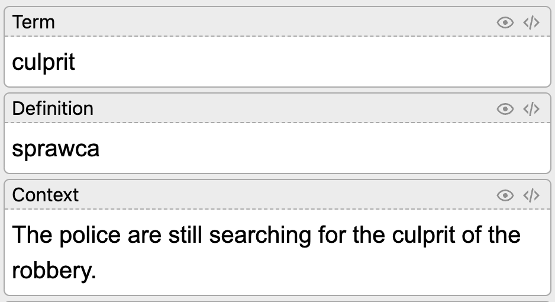

# Create Anki flashcards for learning languages

> GPT3 + Anki

## How to use?

1. Setup *Anki-Connect*: [docs](https://github.com/FooSoft/anki-connect) or
   [screen](https://github.com/AndrewJudson/ankiextension/blob/master/ankiconnect.png)
2. Clone the repo
3. Fill in `.env.local` file with data:

```bash
OPEN_AI_API_KEY=example
ANKI_CONNECT_KEY=example
```

4. Make sure deno is installed
5. Run from shell, providing released version as an argument.

```bash
deno run --allow-env --allow-net --allow-read main.ts
```

## Configuration

You can pass additional flags:

```bash
  --deck       Name of the deck to which you want to add flashcards (default: EnglishAI)
  --file       Name of the file containg the words to be translated (default: list.txt)
  --language   Language into which you want to translate the words (default: polish)
```

Example:

```bash
deno run --allow-env --allow-net --allow-read main.ts --file example_file.txt --deck MyDeck --language Spanish
```

To change the language of the words in the file, edit the prompt.
To change the Anki's card model, edit the `MODEL` variable and property `fields` in body sent to *Anki-Connect*

## Added flashcard

